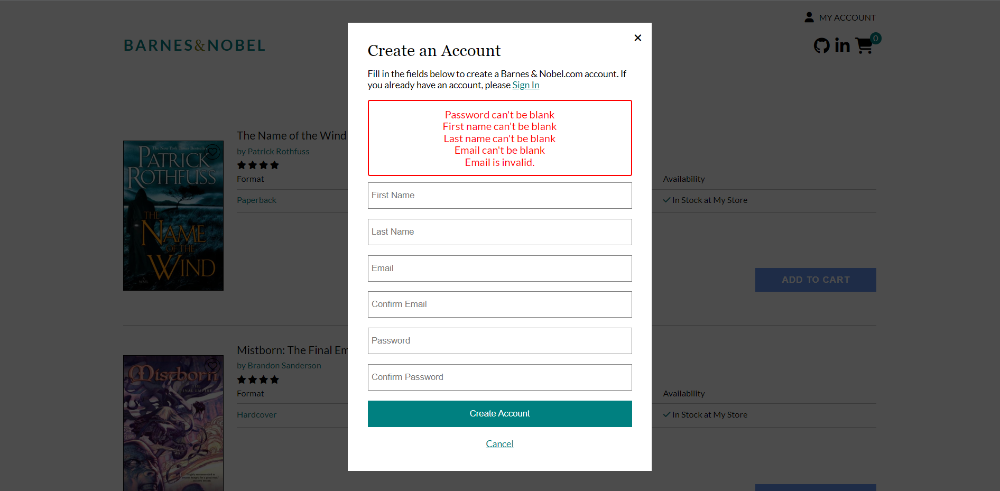
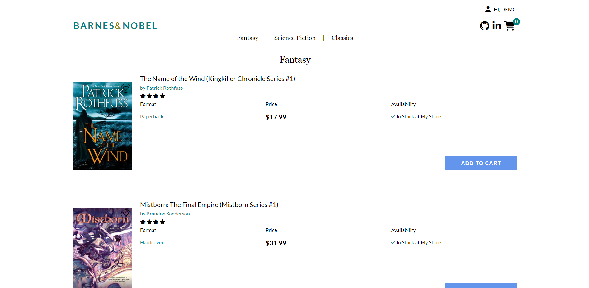

# Welcome to Barnes & Nobel
This is the [live site](https://barnesandnoble.onrender.com/)!

## Introduction

- summary of barnes + noble's functionalities + its purpose

Barnes & Nobel is a clone of the website, Barnes & Noble. Barnes & Noble is an e-commerce website that specializes in print and electronic literature and related merchandise. The products within this site are orgenaized by category or filtered by search. Users are able to add, remove, and edit items within their cart, regardless of their logged in status. Users with an account can also utilize wishlists. Barnes & Noble also includes functionality to review products. The technologies implemented in this project include:
- Language: Javascript, Ruby, HTML, and CSS
- Frontend: React-Redux
- Database: PostgreSQL
- Hosting: Render
- Asset Storage: AWS Simple Cloud Storage (S3)
- Libraries: React-Swiper

# MVPs
## User Auth
Users are able to login or create an account with sufficient error handling.

```js
    return (
        <>
            {currModal === "signup" && (<div className="signup-comp">
                <div className="signup-header">
                    <h3>Create an Account</h3>
                    {/* <p onClick={closeModal}>x</p> */}
                </div>
                <div className="signup-login-link">
                    <p onClick={() => setCurrModal('login') }>
                        Fill in the fields below to create a Barnes &#38; Nobel.com account. If you already have an account, please <span id="signup-links">Sign In</span>
                    </p>
                </div>
                <form onSubmit={handleSubmit} className="signup-form">
                    {!!errors.length && <div className="errors">
                        {errors.map(error => <p key={error}>{error}</p> )}
                    </div>}
                        <input
                        type="text"
                        value={firstName}
                        onChange={e => setFirstName(e.target.value)}
                        placeholder="First Name"
                        />
                        <input
                        type="text"
                        value={lastName}
                        onChange={e => setLastName(e.target.value)}
                        placeholder="Last Name"
                        />
                        <input
                        type="text"
                        value={email}
                        onChange={e => setEmail(e.target.value)}
                        placeholder="Email"
                        />
                        <input
                        type="text"
                        value={confirmEmail}
                        onChange={e => setConfirmEmail(e.target.value)}
                        placeholder="Confirm Email"
                        />
                        <input
                        type="password"
                        value={password}
                        onChange={e => setPassword(e.target.value)}
                        placeholder="Password"
                        />
                        <input
                        type="password"
                        value={confirmPassword}
                        onChange={e => setConfirmPassword(e.target.value)}
                        placeholder="Confirm Password"
                        />
                    <button className="signup-button" type="submit" onSubmit={e => e.preventDefault() }>Create Account</button>
                    <p onClick={closeModal} id="signup-links">Cancel</p>
                </form>
            </div>)}
            {currModal === 'login' && (
                <LoginForm />
            )}
```

## Products
A Barnes & Nobel user is able to browse products through carousels in the splash page, categories, and product show pages.

```js
    <div className='cart-page'>
        <div className='cart-body'>
            <div className='cart-content'>
            <h1 className='cart-title'>My Shopping Cart</h1>
                <div className='cart-holder'>
                    <h2 className='item-count'>({items.length}) Items from Barnes &#38; Nobel</h2>
                    <div className='cart-items'>
                        {items.map(item => <CartItem key={item.id} item={item} user={user} />)}
                    </div>
                </div>
            </div>
            <div className='cart-side-bar'>
                <h1>Order Summary</h1>
                <div className='checkout-side-bar'>
                    <p>Subtotal ({totalItems} items)</p>
                    <p>${totalPrice.toFixed(2)}</p>
                </div>
                <div className='checkout-side-bar'>
                    <p>Estimated Shipping</p>
                    <p>{shipping}</p>
                </div>
                <div className='checkout-side-bar'>
                    <p>Estimated Tax</p>
                    <p>$0.00</p>
                </div>
                <div className='line' />
                <div className='bold checkout-side-bar'>
                    <h2>Order Total:</h2>
                    <h2>${total}</h2>
                </div>
                <button onClick={handleCheckout} className='checkout-button' disabled={isEmpty} style={{ backgroundColor: buttonColor, cursor: cursorType }} >{buttonText}</button>
                {showModal && (
                    <Modal onClose={closeModal } >
                        <CheckoutLogin closeModal={closeModal} type={type} />
                    </Modal>
                )}
            </div>
        </div>
    </div>
```

## Shopping Cart
Users are able to view, add, remove, and edit the quantity of items added to cart. Any additions to the cart while logged out should be persisted and added to the user's cart at login.

```js
    return (
        <div className="cart-item">
            <div className="header">
                <NavLink to={`/${product.id}`}>
                    <h2>{product.name}</h2>
                    <p>by {product.seller}</p>
                </NavLink>
            </div>
            <div className="cart-item-content">
                <div className="img-wrapper">
                    <NavLink to={`/${product.id}`}>
                        
                        <p>{product.format}</p>
                    </NavLink>
                    <div className="cart-remove-button">
                        <button onClick={handleRemove}>Remove</button>
                    </div>
                </div>
                <div className="pricing">
                    <p className="item-price">${product.price}</p>
                    <input
                        onChange={handleChange}
                        onBlur={handleBlur}
                        type="number"
                        value={quantity}
                    ></input>
                    <p className="total-item-price">${(product.price * item.quantity).toFixed(2)}</p>
                </div>
            </div>
        </div>
    )
```
